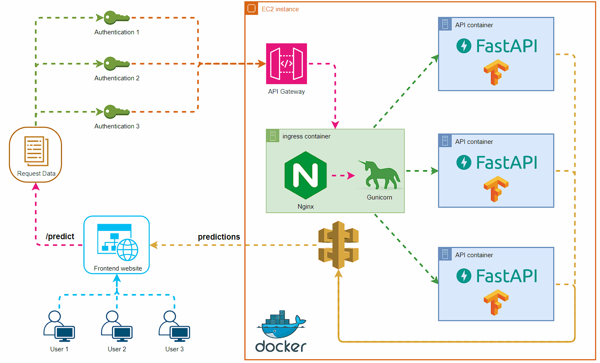

# Machine Learning To Production

> [!IMPORTANT]
> Our project during the university course, we have deployed a webapp to classify garbage images. We have used **ResNet50** model to classify the images. The model has been trained on the dataset of 6 classes: **cardboard, glass, metal, paper, plastic, trash**. The model has achieved **90%** accuracy on the test set.
> You can see the proof at [our report](https://thangbuiq.github.io/garbage-classification-web).
> But because of the cost, we have to stop the service. So, we choose **Render** to deploy our webapp and change the model to **Zero-shot learning** instead of **ResNet50**.

> [!NOTE]
> View our webapp at => [garbage-classification-web.vercel.app](https://garbage-classification-web.vercel.app/)

- Architect Design:

  

# Thank you for visiting
